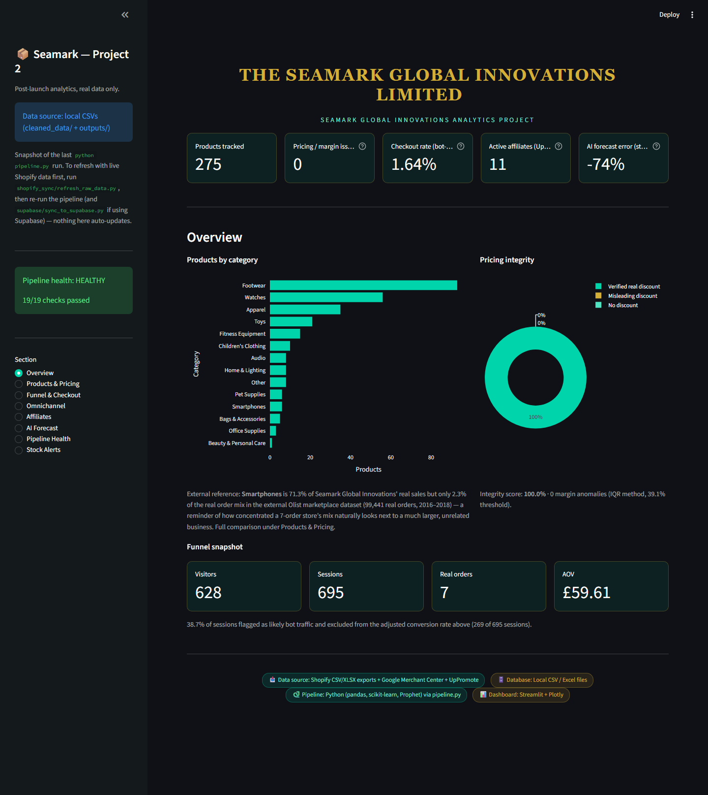
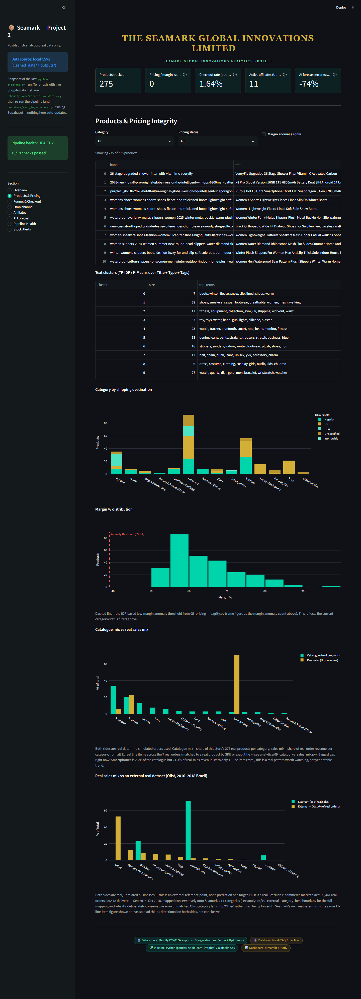
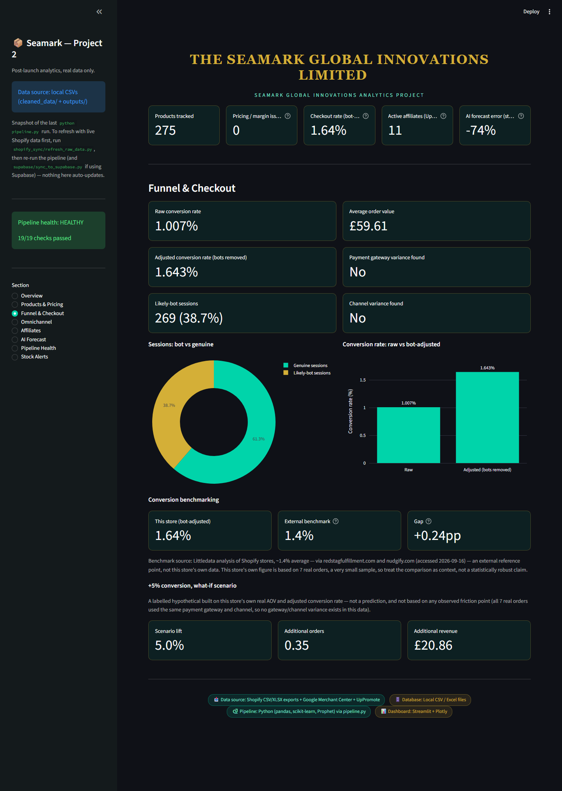
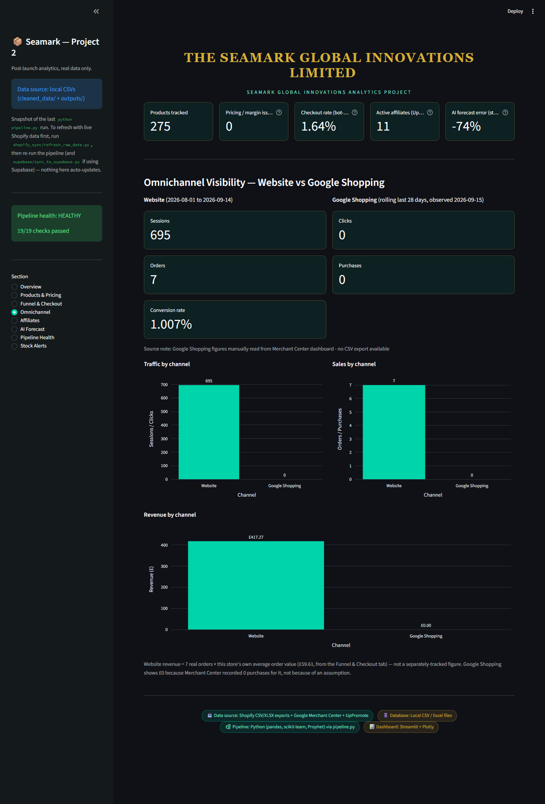
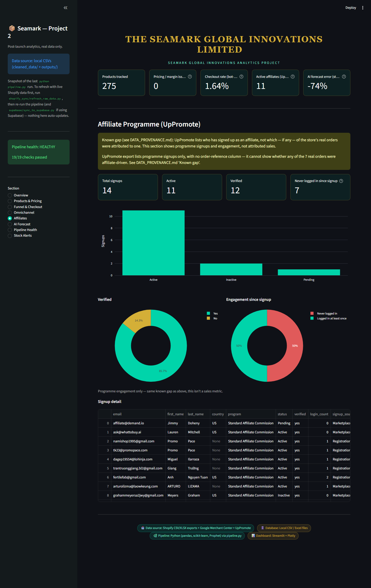
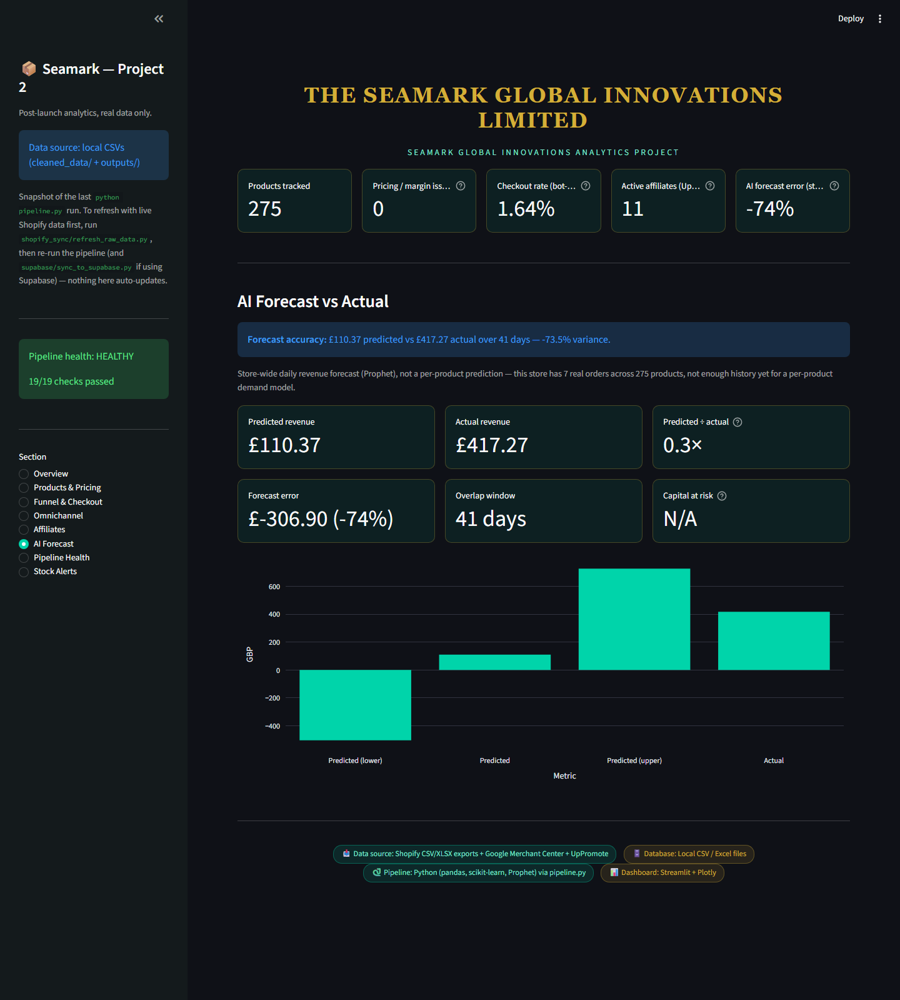
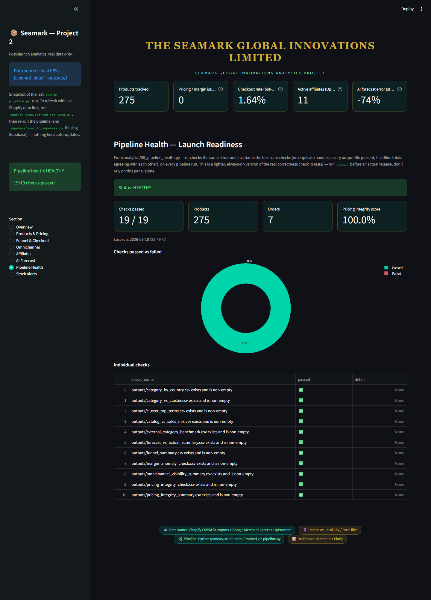
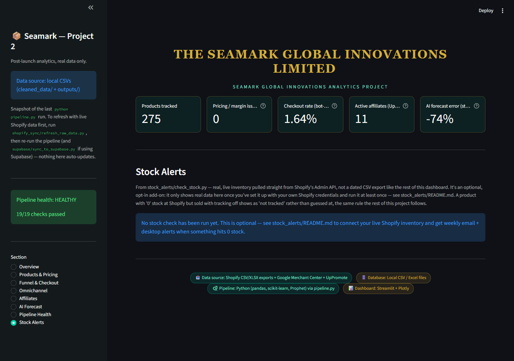
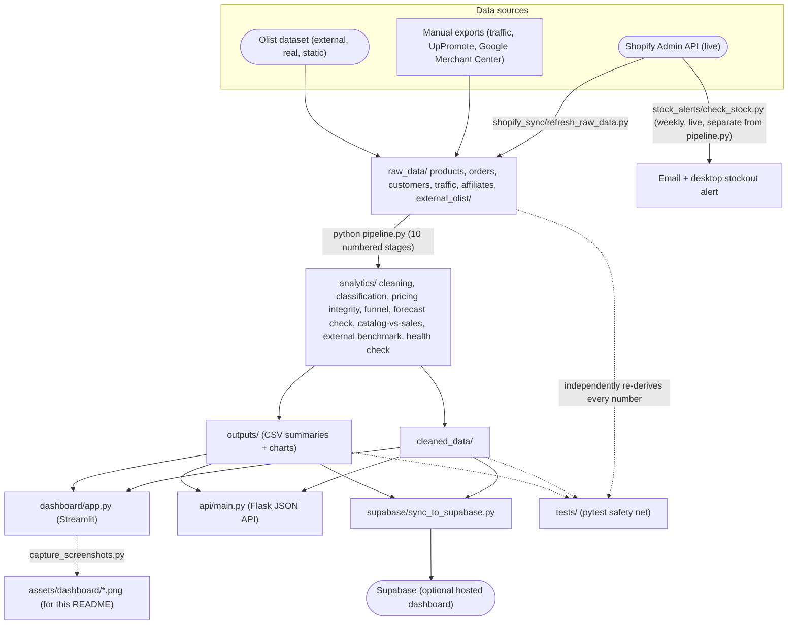

# Seamark Global Innovations — Post-Launch Data Science Project (Project 2)

[](https://github.com/sunny171p/The-Seamark-Global-Innovations-DataScience-Platform-2/actions/workflows/ci.yml)

Author: Sunday Emmanuel Azeez

This is a real-data analysis of Seamark's relaunched Shopify store. It covers product classification, pricing integrity, the checkout funnel and bot-traffic adjustment, forecast-vs-actual revenue, omnichannel visibility, and affiliate signups, all served through a numbered pipeline, a Flask API, and a Streamlit dashboard. Every number traces back to a real export listed in `DATA_PROVENANCE.md`. Nothing on the dashboard, in the API, or in `outputs/` is simulated. The point of this README is that anyone can clone it, install it, and run the whole thing without hitting an error, not just someone who's been following along the whole time.

## Dashboard

These are full-page captures of every section in `streamlit run dashboard/app.py`, taken from a live run against this project's own real data. No mockups. If you want to regenerate them after a data refresh, see `dashboard/capture_screenshots.py`.

### Overview


### Products & Pricing


### Funnel & Checkout


### Omnichannel


### Affiliates


### AI Forecast


### Pipeline Health


### Stock Alerts


## How data actually flows through this



Two things worth pointing out about this shape on purpose. First, `stock_alerts/` is drawn going straight from the live Shopify API to an alert, bypassing `pipeline.py` entirely — that's deliberate, covered in the "Quick start — stock alerts" section below, since `pipeline.py` should never silently hit the network. Second, `tests/` reads from `raw_data/`, `cleaned_data/`, and `outputs/` at the same time and checks them against each other, not just against a single stage's own output — that's what "independently re-derives every number" means in practice, and it's why a passing test suite is worth more here than a script that just ran without crashing.

## Project structure

```
analytics/     10 numbered stages — the actual analysis (run via pipeline.py)
api/           Flask API that serves the pipeline's outputs as JSON
dashboard/     Streamlit dashboard — the single-screen view of everything
supabase/      Optional: push pipeline outputs to Supabase for a hosted dashboard
stock_alerts/  Optional: weekly live Shopify stock check, with email +
               desktop out-of-stock alerts — separate from pipeline.py
               on purpose, since it's the one thing here that calls a
               live API instead of reading a dated export
tests/         pytest suite — re-derives every number independently and checks it
raw_data/      Real Shopify/UpPromote/Google Merchant Center exports, plus
               raw_data/external_olist/ — a real external dataset used only
               for one labelled comparison chart, never blended into
               Seamark's own numbers (see DATA_PROVENANCE.md)
cleaned_data/  Stage 1's output — the cleaned products/orders/customers
outputs/       Every other stage's output CSVs — what the API/dashboard read
```

There isn't one single `requirements.txt` for the whole project. The pipeline, the API, the dashboard, and the Supabase sync each have their own, because most people running this only need one of them. Install whichever one you actually need, following the steps below.

## Quick start — analytics pipeline only

```
pip install -r requirements.txt
python pipeline.py
python -m pytest tests/ -v
```

`pipeline.py` runs all 10 stages in order and prints `[OK]` or `[FAIL]` for each one at the end. If a stage fails with `ModuleNotFoundError`, it just means a package from `requirements.txt` isn't installed in whichever Python environment you're running. Re-run the `pip install` line above, in that same environment, and try again.

The test suite doesn't trust the pipeline's own arithmetic. Every test file recomputes its numbers independently from `raw_data/`/`cleaned_data/` and checks that the saved output agrees. So a passing suite means the outputs are actually correct, not just that the scripts ran without crashing.

## Quick start — dashboard

```
python pipeline.py                     # if you haven't already
pip install -r dashboard/requirements.txt
streamlit run dashboard/app.py
```

Full details, including the optional Supabase-backed setup for a hosted dashboard, are in `dashboard/README.md`.

## Quick start — API

```
pip install -r api/requirements.txt
python api/main.py
```

Full endpoint list and honest-scope notes are in `api/README.md`.

## Quick start — stock alerts (optional)

Everything above reads a dated CSV export. This one's different: it checks your **live** Shopify inventory once a week and emails plus notifies you if anything's hit 0 stock. It needs your own Shopify Admin API credentials, so it's opt-in and not part of `pipeline.py`. Full setup (getting a Shopify token, an email app password, and scheduling it weekly on Windows) is in `stock_alerts/README.md`.

## If something fails on a fresh machine

1. Check you're installing into the same Python environment you're running scripts from. Running `pip install X` in one environment and `python script.py` in another is the most common cause of a `ModuleNotFoundError` that looks like a real bug but isn't.
2. Run the pipeline stage that failed on its own (`cd analytics && python 0X_whatever.py`) to see the full traceback, rather than the trimmed error `pipeline.py` prints.
3. Run stages in order. `pipeline.py` does this for you automatically, but running an analytics script by hand out of order (Stage 4 before Stage 1, say) will fail, because later stages read earlier stages' output files.
4. Nothing here reads from or writes to any path outside this project folder, and nothing is hardcoded to a specific machine or OS. If you hit a path error, it's almost certainly #3, not some difference in your environment.

## Honest scope — read before trusting a number for something real

This project is deliberately conservative about what it claims:

- The AI Forecast is a real **store-wide** revenue forecast (from Project 1's Prophet model), checked against real actual revenue. It's not a per-product prediction. This store has 7 real orders across 275 products, nowhere near enough history for a per-SKU forecast that wouldn't just be fabricated precision.
- Affiliate numbers are UpPromote signup and engagement counts, not order attribution. UpPromote's export doesn't have an order-reference column to attribute from.
- Bot-traffic flagging is a documented heuristic (data-center-town matching), not a claim of certainty. See `BOT_MITIGATION_README.md` for how it works.
- No static inventory-quantity export exists, so nothing in the core pipeline or dashboard claims a dead-stock or stockout count from a dated file. The one exception is the optional `stock_alerts/` add-on. It reads real, live stock levels straight from Shopify's Admin API, but only once you've set up your own Shopify credentials for it (see `stock_alerts/README.md`). It's opt-in, not part of the core pipeline's own data.
- The external category benchmark (Olist Brazilian E-Commerce dataset, 2016–2018) is a labelled reference point against one large, real, unrelated business. It's not a prediction, and it's never used to adjust the AI Forecast or any other Seamark number.

`DATA_PROVENANCE.md` has the full source-by-source breakdown of every raw file used, what was verified against what, and what was explicitly excluded and why.

## Background: Project 1 and Project 2

Project 1 came first, before the store had taken a single real order. It cleaned up the raw Shopify product export, sorted 316 products into categories, and audited every price for the "compare at" trick stores use to fake a discount. It benchmarked prices against Amazon UK, looked at traffic and affiliate signups, and built a Prophet forecasting model. There was no real sales history yet, so that forecast ran on a synthetic order series just to prove the engine worked. The biggest thing it turned up: roughly 95.6% of price-checked products had a discount the pricing data didn't actually support. Worth catching before customers start noticing.

Project 2 is what happens once the store actually goes live. Same checks, mostly: pricing integrity, the funnel, traffic, competitive pricing, affiliates. But now against real orders instead of a pre-launch snapshot, with a bot-traffic adjustment added so the funnel numbers don't get skewed by fake sessions. It compares what's in the catalog against what people are actually buying, and it pulls fresh data straight from Shopify through `shopify_sync` instead of someone exporting a CSV by hand every time. There's a full test suite too, one that re-derives every number independently rather than trusting the pipeline's own math. And at one point real customer data ended up in the repo's git history by mistake. That got fixed, and it's written up here instead of quietly buried, because it's a real lesson worth passing on.

## Forking this for your own store

Point it at your own Shopify export and a few things just come with it. A pricing-integrity check most small stores never bother running, the kind that catches a "sale" badge that isn't really a sale, which is a trust problem and possibly a compliance one. A funnel analysis that already knows to filter out bot traffic, so your conversion rate isn't quietly lying to you. A catalog-vs-sales comparison, one number that tells you whether you're stocking the wrong mix. A forecasting engine that's honest about what it can and can't predict; it won't pretend to know per-product numbers once your order history is too thin for that. A weekly stock-alert script instead of paying for one. And a test suite plus a provenance habit baked in already, so a change you make later gets caught fast if it breaks something, and your customers' data doesn't quietly end up somewhere public the way it briefly did here.

## Past the CSV pipeline: a small data engineering layer

Everything above still works exactly as described, `pipeline.py`, the CSVs, the test suite that recomputes its own numbers, none of that changed or got replaced. What sits on top of it now is a second layer that most small-store projects skip, added deliberately to show the shape a bigger version of this would need to take, not because eleven real orders actually require it yet. Worth saying plainly, since a reviewer who knows this space will notice the mismatch between the tooling and the order volume, and the honest answer is that it's there on purpose, built ahead of the data rather than because of it.

**A queryable warehouse.** `warehouse/build_duckdb.py` loads every CSV in `cleaned_data/` and `outputs/` into a single local DuckDB file. No server, no credentials, nothing to host, just a file that turns "open two CSVs and join them in pandas" into one SQL query. It's the same numbers, just queryable.

**A dbt project.** `dbt_seamark/` reads from that same DuckDB file and answers one question a second way, in SQL instead of pandas: how the catalog compares to what actually sold, category by category. It's built to be checked against `analytics/09_catalog_vs_sales_mix.py`'s own answer, not to replace it, the same independent-verification habit the test suite already follows, just in a different tool. It also generates a real, browsable lineage graph and documentation site with one command, `dbt docs generate && dbt docs serve`.

**Schema validation with Pandera.** `quality/validate.py` checks that `cleaned_data/`'s files still have the shape every downstream script expects, right column names, no negative prices, no unexpected financial status, before a silent schema drift has the chance to cause a confusing error three stages later instead of a clear one immediately. It deliberately never prints the contents of a failed row from `orders_clean.csv`, since that file can carry a real customer's data, only which column failed and why.

**Docker Compose.** `docker-compose.yml` runs the dashboard and the API together with one command, `docker compose up --build`, for anyone who'd rather not worry about matching a local Python version. It expects `cleaned_data/` and `outputs/` to already exist, run `python pipeline.py` first, same as always, and mounts them in rather than baking any real data into an image.

**A Shopify webhook listener.** `shopify_sync/refresh_raw_data.py` is still how this project pulls data, on demand, in batches. `shopify_sync/webhook_listener.py` is the other way to do it: Shopify posts to it the instant a real order happens, instead of waiting to be asked. It verifies the request actually came from Shopify, then lands the raw event as its own JSON file under `raw_data/webhook_events/`, gitignored, same as every other real-customer-data file here. `shopify_sync/fold_webhook_events.py` is the separate second step that turns those landed files into rows appended to `orders_export.csv`. Splitting receiving from transforming like that turned out to matter for real, not just on paper, once this actually got tested end to end. A real webhook subscription, registered in Shopify's own admin, tunnelled out to a local run with ngrok, fired through Shopify's own "send test notification" button. The signature check passed. The event landed as a file. The fold step picked it up and appended it correctly. That same test also caught something worth catching before it mattered rather than after, and the full story's in `CASE_STUDY.md`.

**A real dependency graph, not just a fixed script order.** `pipeline.py` runs all ten stages one at a time, in one fixed order -- genuinely fine at this project's real size, but not how this would actually get run at a bigger one. `orchestration/prefect_flow.py` is a second way to run the exact same ten scripts, unchanged, using Prefect to express which stages can run at the same time because neither needs the other's output (five of them do, once Stage 1's done) and which genuinely have to wait their turn, plus an automatic retry on a transient failure instead of the whole run just dying. See `orchestration/README.md` for the actual dependency graph and how to run it, including an honest note on what could and couldn't be verified before this was called done.
